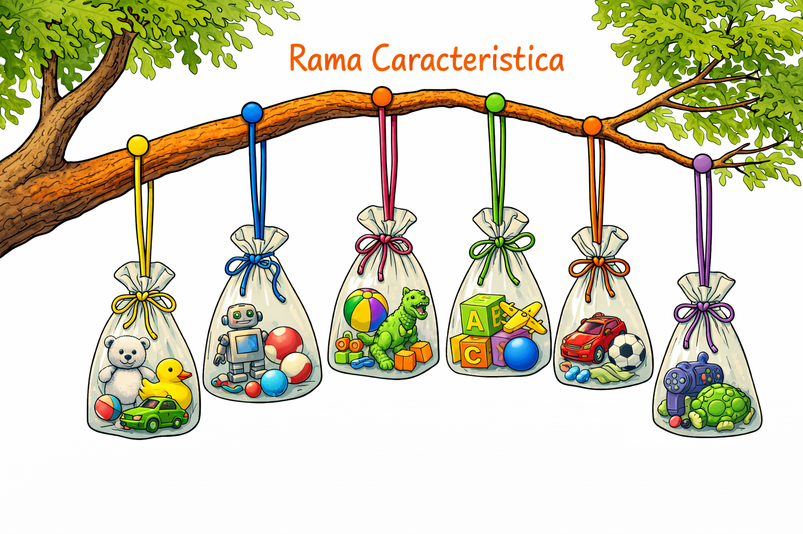
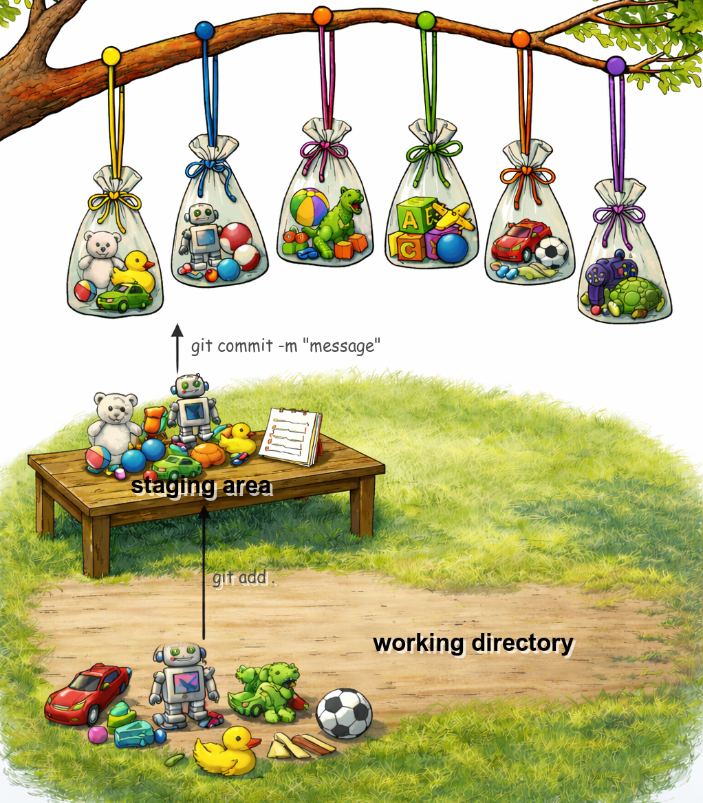

## Cómo funciona Git

Una forma de ver cómo funciona git es mediante el siguiente ejemplo: Tenemos un arbol (repositorio) el cual tiene ramas (branches). A su vez a cada rama le vamos a ir agregando cosas , las cuales van a estar agrupadas en bolsas (commits). 

Git permite gestionar todo el arbol! 


> **Tip:**  Los nombres de las ramas pueden ser los que quieras; sin embargo, existen convenciones para estandarizarlos, las cuales veremos en próximos capítulos.


## 3. Ramas (Branches)

Una rama (branch) es una línea de cambios independendiente dentro de un mismo repositorio, y en ella puedes agregar cambios sin afectar el trabajo de otros.

En la analogía del arbol una rama es un lugar donde puedes colgar paquetes de cambios (objetos) llamados commits. 

## 2. Commits

Un commit es una bolsa cerrada que contiene un conjunto específico de cambios del proyecto en un momento determinado.




### 1️⃣ Es un punto en el tiempo

Cada bolsa está colgada en un lugar específico de la rama.

Eso significa:

* No es algo flotante.
* Tiene una posición exacta.
* Tiene un commit anterior (la bolsa anterior en la rama).

### 2️⃣ Es una fotografía del estado del proyecto

La bolsa no contiene “solo un juguete nuevo”.

Contiene:

* El juguete nuevo
* Y todos los juguetes que ya estaban antes

**📍En Git:** Un commit guarda el estado completo del proyecto (snapshot), no solo el cambio incremental.

## 3️⃣ Es inmutable

Una vez que la bolsa está cerrada y colgada:

* No puedes meter más juguetes.
* No puedes quitar juguetes.
* Solo puedes colgar una nueva bolsa después.

**📍En Git**: Un commit no se edita. Si quieres cambiar algo, haces otro commit.


## 3. Working Directory

> Es el suelo debajo del árbol donde estás jugando con los juguetes.

Ahí:

* Sacas juguetes de una bolsa anterior.
* Modificas juguetes.
* Pintas uno.
* Rompes otro.
* Creas uno nuevo con bloques.

Pero todavía no están guardados en una bolsa.

📍**En Git** : El working directory es donde ocurren los cambios, pero todavía no forman parte de la historia.

* Son los archivos en tu carpeta del proyecto.
* Puedes modificarlos libremente.
* Git aún no los ha “empaquetado”.


## 4. Staging Area

> Es una mesa al lado del árbol donde eliges qué juguetes van a entrar en la próxima bolsa.

No todo lo que está en el suelo necesariamente entra en la bolsa.

Puedes:

* Tomar solo el oso.
* Dejar el robot fuera.
* Incluir el auto nuevo.
* No incluir el juguete roto.

Eso es exactamente lo que hace el comando 
```
git add .
```

📍**En Git** : El staging area es la lista exacta de cambios que formarán parte del próximo commit.

* Es un área intermedia.
* Decide qué cambios van a formar parte del próximo commit.
* No es todavía un commit.


Échale un vistazo a la siguiente imagen donde se muestra el `working directory` y el `staging area`




## 5. HEAD

La última bolsa de la rama

📍**En Git**  es  el último commit sobre el cual estamos trabajando


[<- Volver ](https://github.com/icnovaro/playing-with-git/blob/trunk/github-foundations/introduction-to-git/3.como_funciona.md) | 
[Siguiente -> Ejercicio #1  ](https://github.com/icnovaro/playing-with-git/blob/trunk/github-foundations/introduction-to-git/4.ejercicio_1.md)