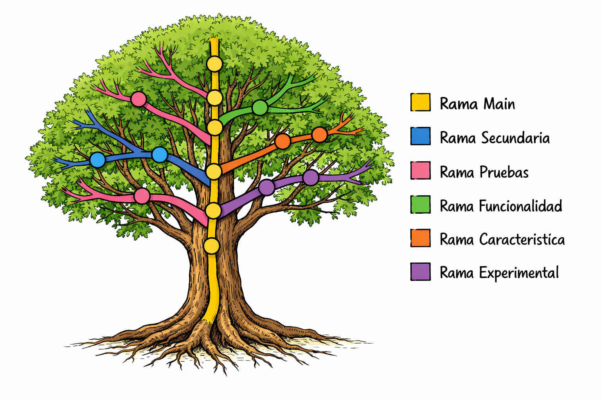

## Introducción a Git

El desarrollo de software moderno exige algo más que escribir código: requiere **control, trazabilidad y colaboración efectiva**. En proyectos reales, múltiples desarrolladores trabajan simultáneamente sobre los mismos archivos. Sin un sistema adecuado para gestionar los cambios, mantener el orden se vuelve difícil y los errores pueden multiplicarse rápidamente.

Aquí es donde entra **Git**.

Git es un **sistema de control de versiones distribuido** que permite:

- Registrar cambios de forma estructurada.
- Volver a versiones anteriores del proyecto en cualquier momento.
- Trabajar en paralelo mediante ramas (**branches**).
- Colaborar sin sobrescribir el trabajo de otros.
- Mantener un historial completo y auditable del proyecto.

En lugar de guardar múltiples copias de un mismo archivo con nombres como `proyecto_final_v3_definitivo_ok_ahora_si.zip`, Git construye un **historial basado en commits**, donde cada cambio queda documentado, identificado y conectado dentro de un grafo de versiones.

En este módulo aprenderás:

- Qué es el control de versiones y por qué es fundamental.
- Cómo funciona Git a nivel conceptual.
- Qué son el **working directory**, el **staging area (index)** y el **commit history**.
- Cómo empezar a usar Git correctamente desde el primer día.

Es normal que Git parezca complejo al inicio. Internamente maneja objetos, referencias y un grafo de commits, lo que puede resultar abstracto. Sin embargo, una vez que comprendes su modelo mental, Git deja de ser confuso y se convierte en una herramienta extremadamente poderosa.

Aprender Git no es solo aprender comandos. Es aprender a trabajar de forma profesional en entornos colaborativos.

## Cómo funciona Git

Una forma de ver cómo funciona git es mediante el siguiente ejemplo: Tenemos un arbol (repositorio) el cual tiene ramas (branches) y cada rama tiene hojas (commits). Git permite gestionar todo el arbol agregando y quitando ramas, hojas , etc. 

Échale un vistazo a la siguiente imagen, cada circulo hace referencia a un *commit*

> **Tip:**  Los nombres de las ramas pueden ser los que quieras; sin embargo, existen convenciones para estandarizarlos, las cuales veremos en próximos capítulos.